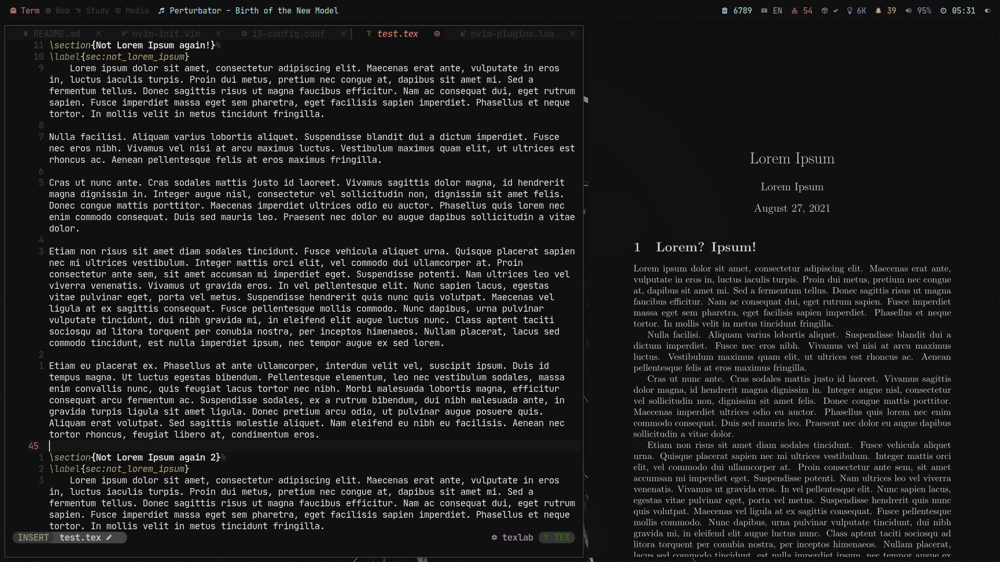
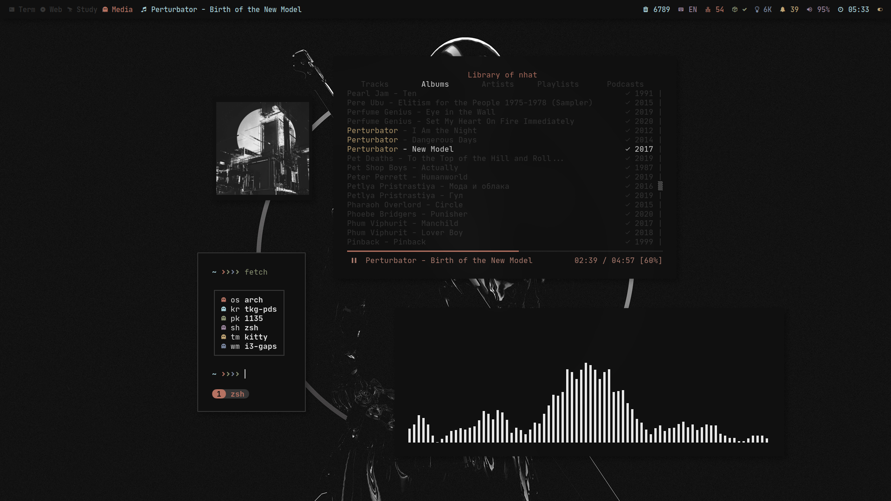
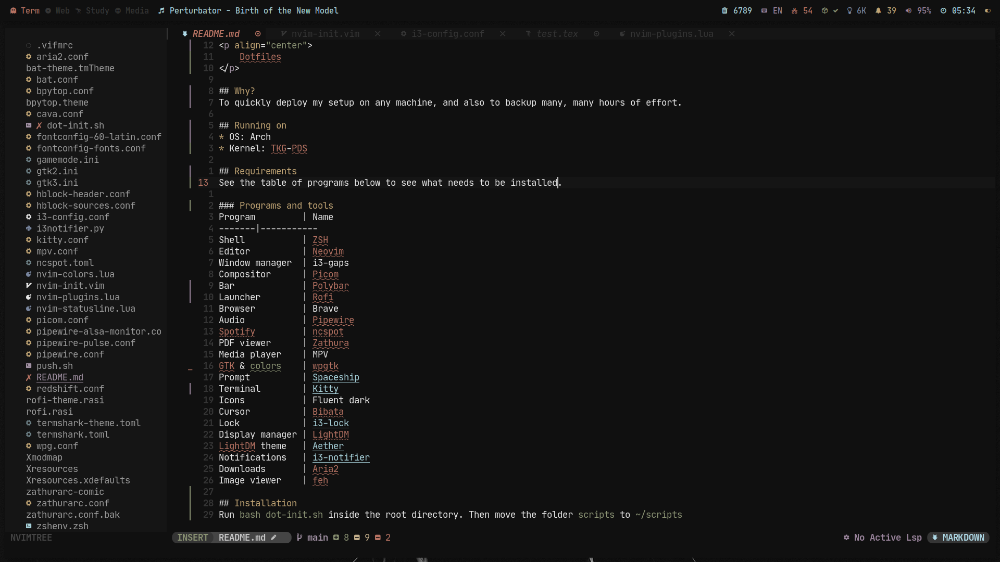
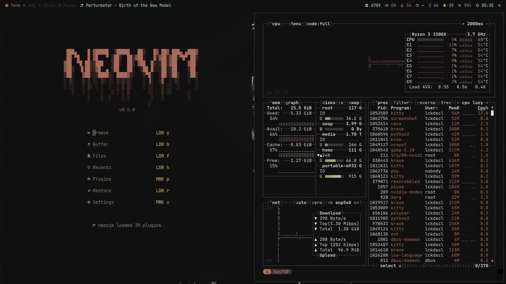

<h1 align="center">
    Dotfiles
</h1>

## Why?
To quickly deploy my setup on any machine, and also to backup many, many hours of effort.

## Screenshots

## Running on
* OS: Arch
* Kernel: TKG-PDS

## Requirements
See the table of programs below to see what's needed to be installed.

### Programs and tools
Program         | Name
-------|-----------
Shell           | ZSH
Editor          | Neovim
Window manager  | i3-gaps
Compositor      | [Picom](https://github.com/jonaburg/picom)
Bar             | [Polybar](https://github.com/polybar/polybar/)
Launcher        | [Rofi](https://github.com/davatorium/rofi)
Browser         | Brave
Audio           | Pipewire
Spotify         | [ncspot](https://github.com/hrkfdn/ncspot)
PDF viewer      | Zathura
Media player    | MPV
GTK & colors    | [wpgtk](https://github.com/deviantfero/wpgtk)
Prompt          | [Spaceship](https://github.com/spaceship-prompt/spaceship-prompt)
Terminal        | [Kitty](https://github.com/kovidgoyal/kitty)
Icons           | Fluent dark
Cursor          | Bibata
Lock            | [i3-lock](https://github.com/Raymo111/i3lock-color)
Display manager | LightDM
LightDM theme   | [Aether](https://github.com/NoiSek/Aether)
Notifications   | [i3-notifier](https://github.com/sencer/i3-notifier)
Downloads       | Aria2
Image viewer    | feh

## Installation
Run `bash dot-init.sh` inside the root directory. Then move the folder `scripts` to `~/scripts`.
